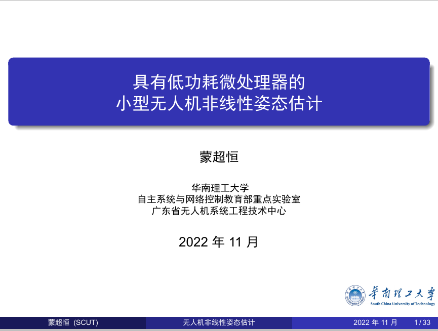
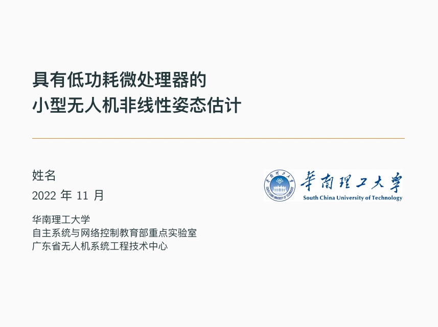
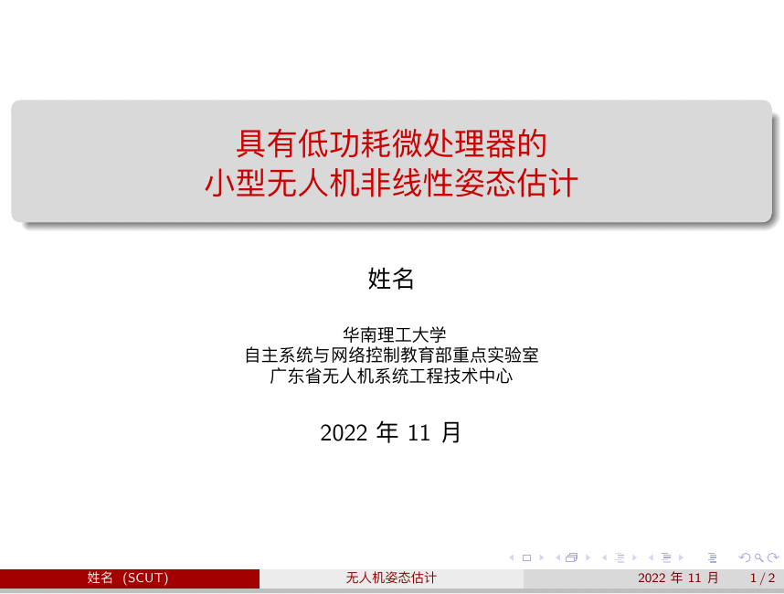
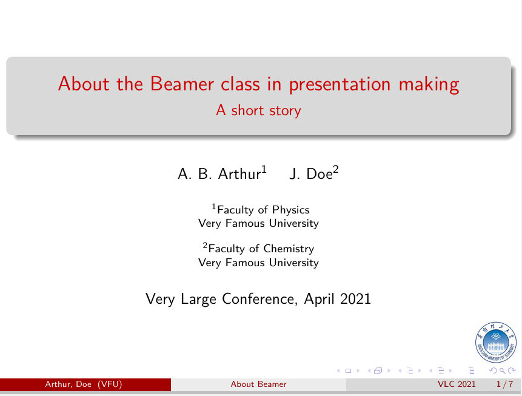

# 华南理工大学Beamer模板

本模版用于撰写华南理工大学答辩幻灯片。答辩时播放pdf文件即可。也可以用于其他用途的幻灯片。

## 快速使用：
1.编译之前首先安装[texlive](https://www.tug.org/texlive/)，找到对应系统（Linux，win，macOS）的版本。注意macOS是MacTeX。安装[TeXstudio](https://www.texstudio.org/)或者其他编辑器。

2.在`TeXstudio的Options->Configure TeXstudio->build`中，编译器(Dufault Compiler)选择`XeLaTeX`，默认文献工具(Default Bibliography Tool)选`Biber`或者`BibTeX`，取决于参考文献使用的包，没有参考文献时使用默认即可。

3.编译ppt*.tex即可。其他IDE也可以。

## 学校logo

还需要进一步完善，可以自定义喜欢的图案。

## 主题颜色

[Reference guide](https://www.overleaf.com/learn/latex/Beamer)

