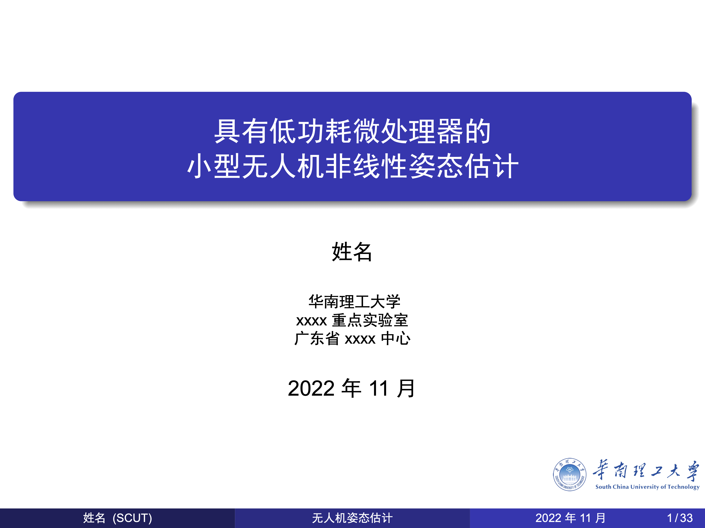
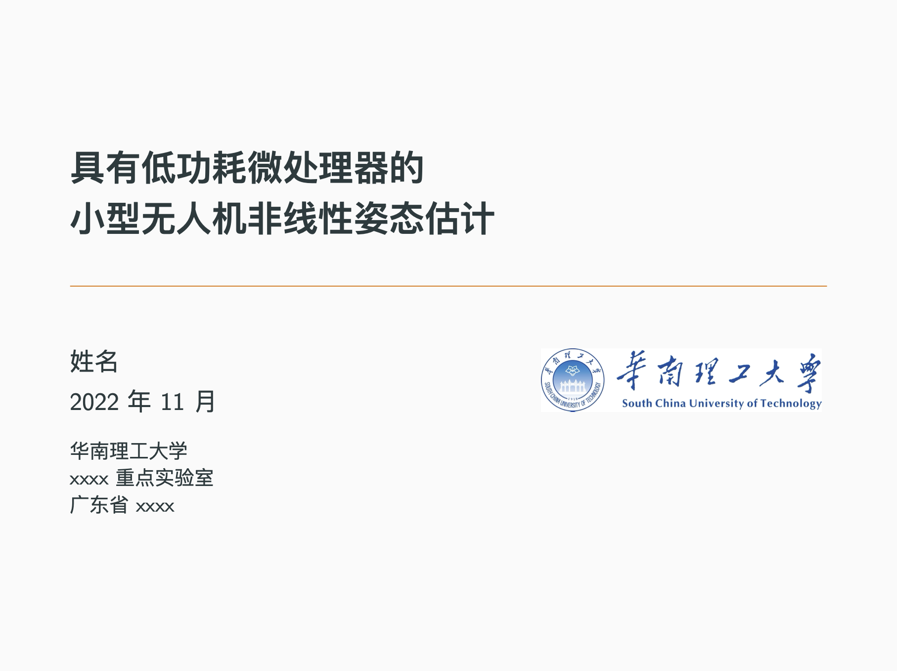
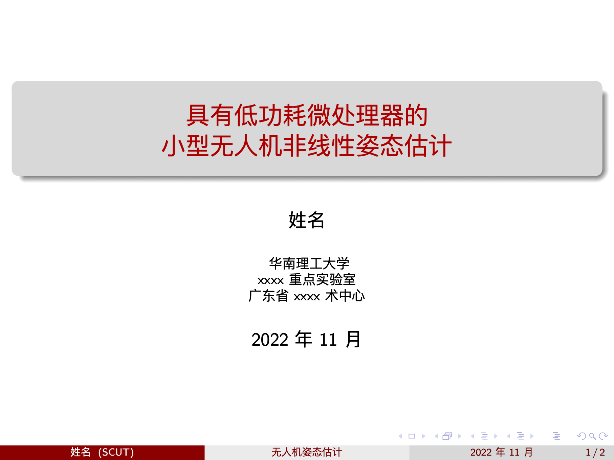
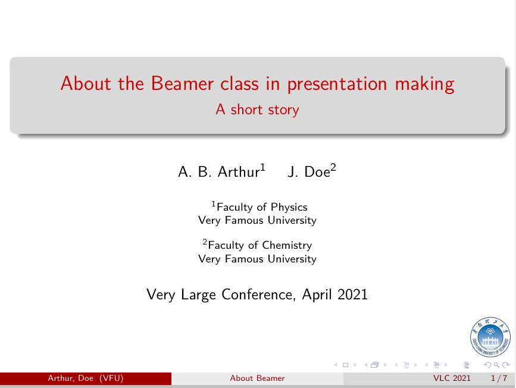

# 华南理工大学Beamer模板

本模板尝试将beamer提供的标准主题用于撰写带华南理工大学logo的幻灯片。最后使用时播放pdf文件即可。也可以用于其他用途的幻灯片。

注意这只是抛砖引玉的模板，只有封面，因为具体的使用命令已经由内置的beamer文档类做完了，很多内置命令需要学习才能使用，当然也不难。可以参考[博士开题答辩应用](https://github.com/mengchaoheng/SCUT_CN_beamer)使用。

## 快速使用：
1.编译之前首先安装[texlive](https://www.tug.org/texlive/)，找到对应系统（Linux，win，macOS）的版本。注意macOS是MacTeX。安装[TeXstudio](https://www.texstudio.org/)或者其他编辑器。

2.在`TeXstudio的Options->Configure TeXstudio->build`中，编译器(Dufault Compiler)选择`XeLaTeX`，默认文献工具(Default Bibliography Tool)选`Biber`或者`BibTeX`，取决于参考文献使用的包，没有参考文献时使用默认即可。

3.编译ppt*.tex即可。有几种风格可选，可以试着分别编译ppt.tex、ppt1.tex、ppt2.tex、ppt3.tex挑选自己喜欢的风格。其他IDE也可以。也可以自定义风格，欢迎推pr。

## 使用案例
[KalmanPresentation](https://github.com/mengchaoheng/KalmanPresentation)；英文版，随手制作的案例。

[博士开题答辩应用](https://github.com/mengchaoheng/SCUT_CN_beamer)：中文版。似乎默认模板的字体字号不是很理想。
## 学校logo

还需要进一步完善，可以自定义喜欢的图案。

## 主题颜色

[Reference guide](https://www.overleaf.com/learn/latex/Beamer)

